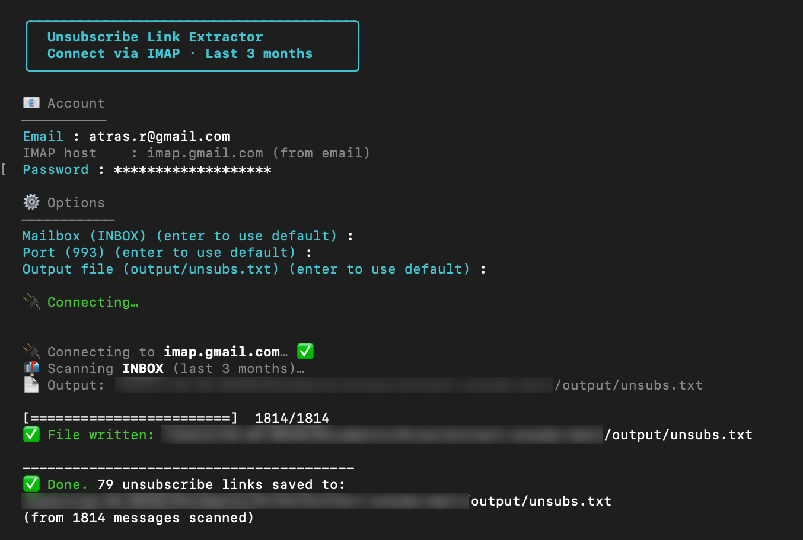

# unsub-extract

**Extract unsubscribe links from your inbox — simple CLI, runs entirely on your machine.**

Connect via IMAP, scan the last 3 months of mail, and get a clean list: one **date**, **sender**, and **unsubscribe URL** per line. Uses the `List-Unsubscribe` header first, then falls back to “unsubscribe” links in the HTML body.



---

## Privacy & security

> **Your data never leaves your machine.**  
> This app runs **100% locally**. It talks only to your IMAP server (e.g. Gmail, Outlook) and writes the result to a file on your computer. No analytics, no third‑party servers, no cloud — just your terminal and your mailbox.

---

## Features

- **Local only** — No data sent to any service except your own email provider.
- **IMAP** — Works with Gmail, Outlook, Yahoo, iCloud, and any IMAP server.
- **Last 3 months** — Scans recent mail so links are more likely still valid.
- **One link per sender** — Keeps the latest unsubscribe URL per address, sorted by date (newest first).
- **Simple output** — Plain text file: `[date/sender]: url`, ready to use or script.

---

## Requirements

- **Node.js** 18+
- **IMAP**-enabled email (Gmail, Outlook, Yahoo, iCloud, or any IMAP server)

---

## Install

```bash
npm install
```

---

## How to use

1. Run the CLI (see [Usage](#usage) below).
2. Enter your **email** and **password** when prompted. The **IMAP host** is filled from your email domain (e.g. `user@gmail.com` → `imap.gmail.com`).
3. For **Mailbox**, **Port**, and **Output file**, press **Enter** to use the defaults, or type a value.
4. The tool connects, scans the mailbox, and writes results to the output file. Progress is shown in the terminal.


### Usage

```bash
npm start
# or
npm run extract
# or
node src/main.js
```

- **Email** and **Password** are required (cannot be left empty).
- **Mailbox** — Default: `INBOX`. For Gmail tabs use e.g. `[Gmail]/Promotions` or `[Gmail]/Social`.
- **Port** — Default: `993` (IMAP over TLS).
- **Output file** — Default: `output/unsubs.txt` (path is relative to the current directory).

---

## Getting your IMAP password

The tool needs your **IMAP password**. This is often **not** your normal email login password.

| Provider | What to do |
|----------|------------|
| **Gmail** | Turn on [2-Step Verification](https://support.google.com/accounts/answer/185839), then create an [App Password](https://myaccount.google.com/apppasswords) (e.g. “Mail” or “Other”). Use that **16-character password** — not your regular Gmail password. |
| **Outlook / Microsoft 365** | Use your Microsoft account password. With 2FA, create an [app password](https://support.microsoft.com/en-us/account-billing/using-app-passwords-with-apps-that-don-t-support-two-step-verification-5896ed9b-4263-e681-128a-a6f2979a7944). |
| **Yahoo** | Enable [two-step verification](https://help.yahoo.com/kb/generate-third-party-passwords-sln15241.html), then generate an **app password**. |
| **iCloud** | Use your Apple ID password, or with 2FA create an [app-specific password](https://support.apple.com/en-us/HT204397). |
| **Other** | Use the password for “IMAP” or “external mail clients”; look for “App password” in your account or help. |

You can **revoke the app password at any time** after using this app (e.g. in your Google, Microsoft, or Yahoo account settings). That way you can create a password for a one-time run and remove it when you’re done.

---

## Output

Results are written to the file you chose (default: `output/unsubs.txt`). Each line:

```
[YYYY-MM-DD/sender@example.com]: https://example.com/unsubscribe?...
```

- **Date** — Message date (newest first in the file).
- **Sender** — From address; only the **latest** unsubscribe link per sender is kept.
- Sorted by **date** (newest first).

The terminal shows only progress (connecting, scanning, progress bar, “File written”, “Done”).

---

## How it works

1. **Connect** — IMAP over TLS (port 993) with your email and password.
2. **Search** — Fetches only messages from the **last 3 months**.
3. **Extract** — For each message: reads `List-Unsubscribe` header (RFC 2369), prefers `https`/`http` then `mailto`; if missing, scans HTML for links containing “unsubscribe”.
4. **Write** — One link per sender (most recent), sorted by date, written as `[date/email]: url`.

---

## License

MIT
